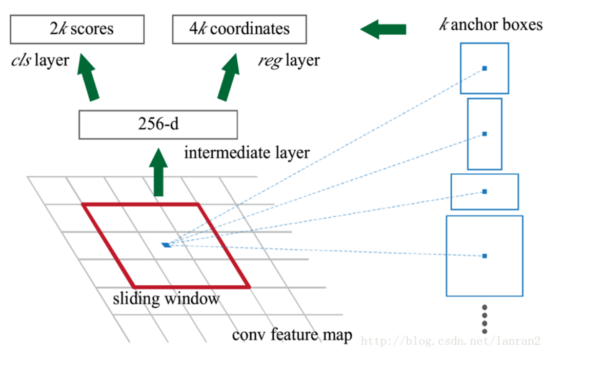

# 概念/技术的笔记小记录

----

### 2022.06.06

#### RPN (Region Proposal Network，Region)

在目标检测两阶段方法中，用来提取建议框的神经网络，
在faster-rcnn中提出，流程如下
- 用神经网络提取特征图，把特征图中的每一个像素的所有通道当做全连接层的向量
- 向量经过全连接层产生2k个分类分数与4k个坐标回归，
2k个分类分数为前后景分数，4k的坐标回归为相较于原始框的坐标调整
- 之后训练完成的RPN网络就可以用于第二阶段的目标检测网络训练
