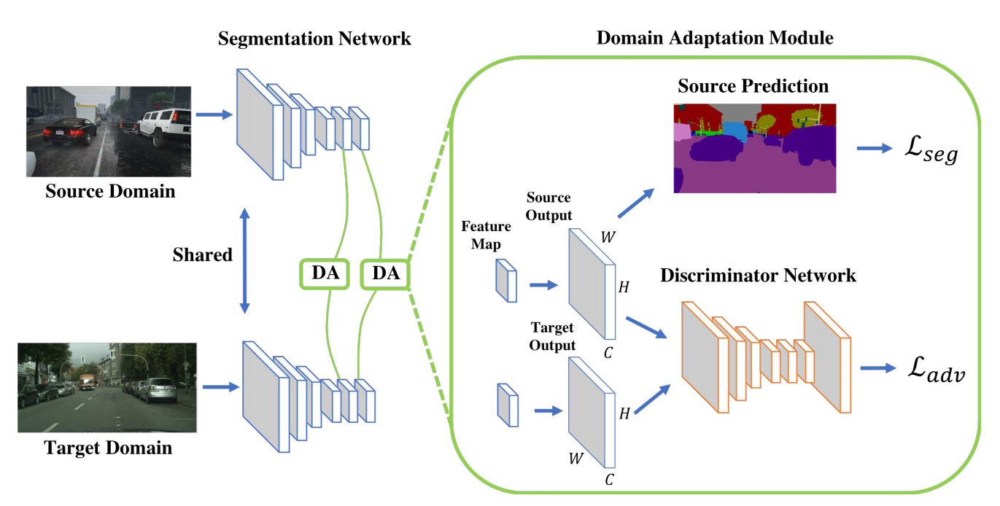
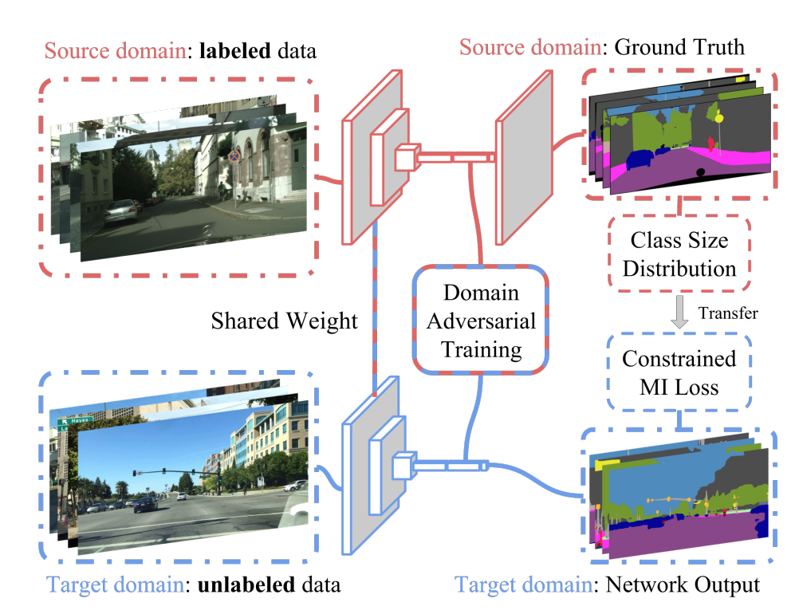
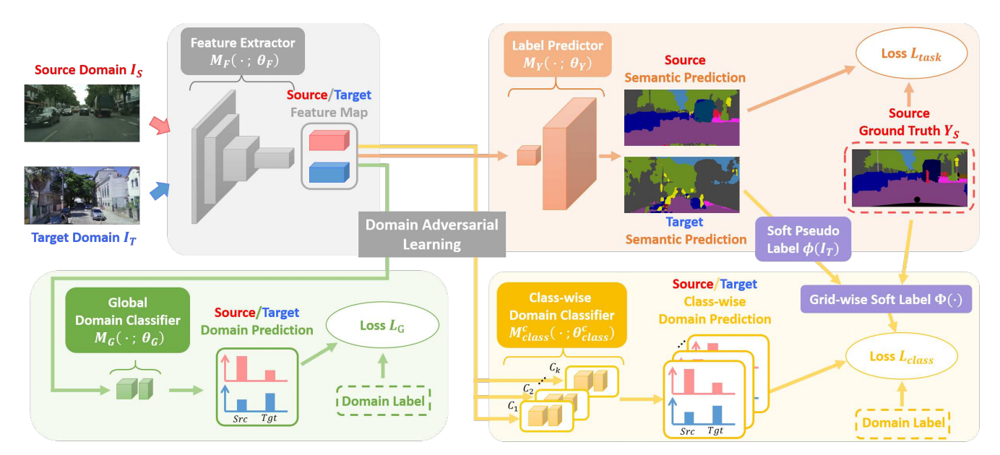
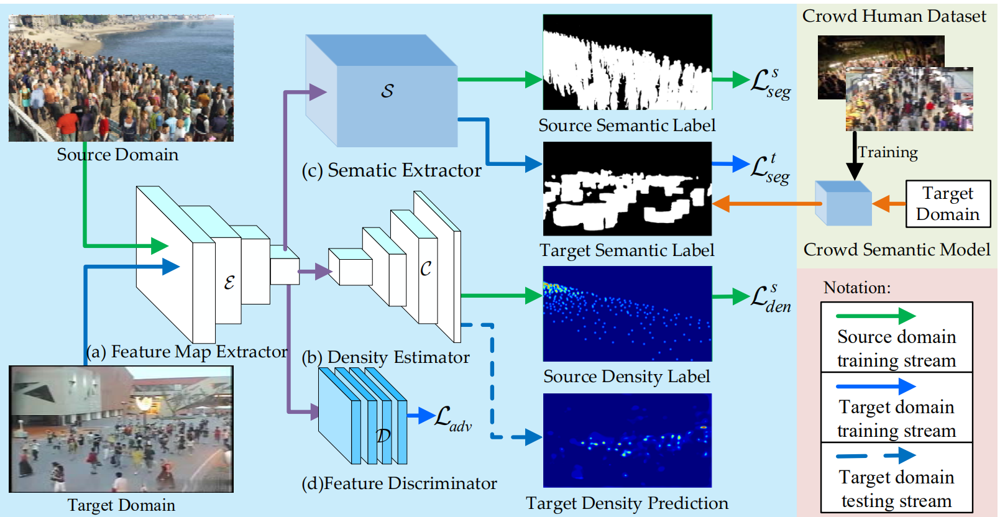
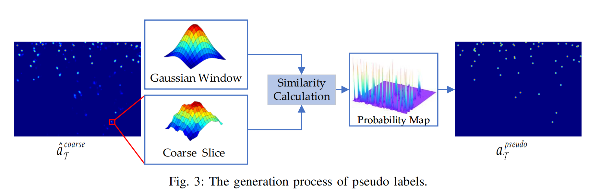

# 论文的笔记小记录

----

### 2022.05.29

#### 1.  Learning to Adapt Structured Output Space for Semantic Segmentation
- `CVPR18` `850引用` 细读
keyword：`domain adaptation` `semantic segmentation` `adversarial learning`

从仿真的原域迁移到真实的目标域时会有很大的域差，这个论文进行了语义分割的域自适应。

- 特征层有很多丰富的语义信息，所以用输出结构来监督。
- 不适合用来域自适应，多层监督的方式可以加强特征。

不同于其他域自适应需要编码器提取一个**域不变特征**，本文提取的是需要输出没有域差，并且进行了两层输出的监督，从而完成域迁移

>评价：新意一般，效果还行，简单有效

#### 2. FCNs in the Wild: Pixel-level Adversarial and Constraint-based Adaptation
- `550引用` 细读
keywords：`domain adaptation` `semantic segmentation` `adversarial learning`

因为上一篇在对比实验中说了一下，所以顺道看了一下

- 贡献了一个真实数据集
- 直接进行了特征图的对抗学习，完成域自适应
- 使用每个类别的分布在所有标签中的占比，约束目标域的预测中标签的占比，虽然作用有限，但是还有用（没太知道怎么优化，但是用处不大）

#### 3. Fully Convolutional Multi-Class Multiple Instance Learning
- `ICLR2015` `300引用` 浏览
keywords：`semantic segmentation` `weakly supervised`

第2篇论文提到了MIL学习，这个东西简单有效
弱监督语义分割，只有图片级别的标签进行语义分割的学习

选择出整张图片中$l$类别相应最大的地方，然后使用loss让他趋向于$1$。其中$l$为图像级别的标签。

#### 4. No More Discrimination: Cross City Adaptation of Road Scene Segmenters
- `ICCV17` `250引用` 粗读
keywords：`domain adaptation` `semantic segmentation` `adversarial learning`

贡献了跨城市的语义分割数据集
融合了各种对抗，来进行域自适应。
- 特征判别器来对齐域的特征
- 类别判别器：总共有类别数个判别器，给每个patch分配一个软标签，
对于源域来说，软标签表示这个类别在这个patch中的占比；目标域来说是这个类别的概率平均
之后让判别器区分这两个域，同时交叉熵的系数为软标签的值，生成器则反过来。（感觉他论文的公式有点问题）

### 2022.05.30

#### 5. FOCUS ON SEMANTIC CONSISTENCY FOR CROSS-DOMAIN CROWD UNDERSTANDING
- `ICASSP20` `20引用` 细读
keywords：`domain adaptation` `crowd counting` `adversarial learning`

加入了一个语义分割辅助任务的域自适应方法。
从仿真域到真实域

- 首先有一个特征判别器来学习域不变特征
- 仿真域有mask标签，网络用一个分割头来分割，用来监督源域分割；
同时使用一个行人检测初始化的网络，生成目标域的行人区域伪标签，然后监督学习目标域的分割，
因为行人检测框是方形框，所以只监督学习方形框外的区域（**有点妙**）

#### 6. Domain-adaptive Crowd Counting via High-quality Image Translation and Density Reconstruction 
- `TNNLS19` 粗读
keywords：`domain adaptation` `crowd counting` `adversarial learning`

论文用GAN生成符合目标域风格的图像进行学习，同时让编码器学习域不变特征与域判别特征（自己的特点和整个的共性），这部分不重要，没什么意思。

下面有意思
- 使用伪标签进行学习，生成伪标签之后，精细化伪标签。
因为人群计数是用高斯核进行处理gt的，滑动窗口计算每个窗口与高斯核相似度。然后从小到大把每个相似度高的地方都当做人的位置，最后生成伪标签进行训练。

#### 7. Error-Aware Density Isomorphism Reconstruction for Unsupervised Cross-Domain Crowd Counting
- `AAAI21` 浏览

>todo

### 2022.06.08

#### 8. You Only Look Once: Unified, Real-Time Object Detection
- `CVPR16` `YOLO系列` 看讲解
keywords：`YOLO` `object detection`

一个不需要

### 2022.06.10

#### 8. 

